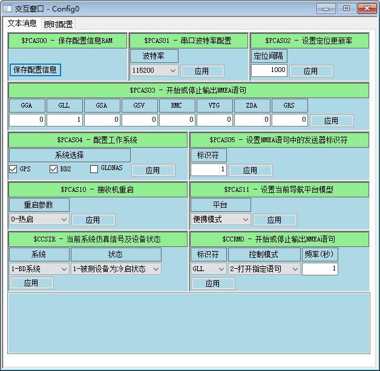

# STM32F103C6X-ATGM336H
通过STM32F103C6x单片机读取ATGM336H的经纬度信息

MCU的串口1接收到ATGM336H输出的GLL格式的信息后，遇到结束符标志`\n\r`，则终止本次的接收，然后对接收到的数据解析拆分得经纬度和UTC时间

需要注意：MCU通过串口烧录完程序后，再将A10接到ATGM336H的RXD引脚

# 使用步骤
1、使用工具“GNSSToolKit_Lite”对GPS进行配置,比如波特率、BD/GPS双模模式、只开启GLL等，见目录下的 `"GPS配置参考.jpg"`； 

2、重新编译并运行；  

3、确认MCU的A10单独连接到GPS模块的TXD引脚，GPS模块的VCC接5.0V； 

4、在调试窗口观察打印信息，如果与实际一致，运行正常。 

# 说明
1. 打包或归档项目时点击`"keilkilll.bat"`文件，可以删除所有日志文件、私密文件，提升安全性，还能降低文件大小
2. 由于C6x系列是小容量型（Low Density，Flash容量不大于32Kb）F103产品，所以移植使其支持C8x系列单片机时，需要更换启动文件。当然，不修改也是可以跑起来的
> startup_stm32f10x_ld.s 对应小容量型（Low Density，Flash容量不大于32Kb）F103产品的启动文件;            
> startup_stm32f10x_md.s 对应中容量型（Medium Density，Flash容量介于64Kb和128Kb）F103产品的启动文件;           
> startup_stm32f10x_hd.s 对应大容量型（High Density，Flash容量不小于256Kb）F103产品的启动文件。           
